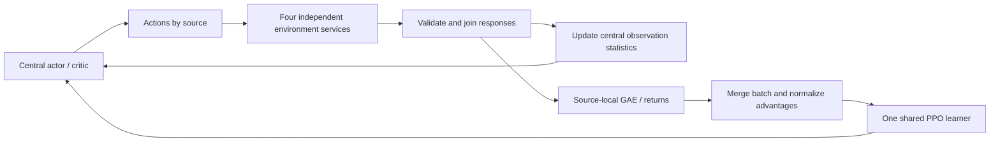

<h1 align="center"> UniDR </h1>

<h3 align="center">
G1 flip tracking with four simulators and one shared PPO learner
</h3>

<p align="center">Languages: English | <a href="README_zh.md">简体中文</a></p>

## Scope and source snapshot

UniDR studies **simulator dynamics as a source of domain randomization**: how
training across different physics engines changes sim2sim and sim2real transfer
relative to a single engine. The task is **G1FlipTracking**, trained with Isaac
Sim, Isaac Gym, Genesis and Motrix. MuJoCo is reserved for fixed-model holdout
evaluation; it supplies no training, online scores, tuning feedback or checkpoint
selection. Development and experiments now focus on flip tracking.

This repository includes the flip task/configuration, central rollout, shared
PPO, adaptive source allocation and the Isaac Sim ground-cloning repair. The
modified dependencies are included under `vendor/` as separate Python packages:

| Owner | Repository path | Upstream baseline before local changes |
| --- | --- | --- |
| UniLab: task/configuration, environment factories, sim2sim | [src/unilab](src/unilab) | `b4e6b58fe0861a435fd19c0f0206bd84f4427a9c` |
| uni_rl: collection, learner, IPC, scheduling and logs | [vendor/unilab_rl](vendor/unilab_rl) | `79418e0cbff7b95fe6e49709b194454701ba20fa` |
| UniSim: physics adapters and vendor workers | [vendor/unisim](vendor/unisim) | `4270aa81d868744980db90dac6dd959d3f542f50` |

Baseline SHAs alone do not identify the modified implementation. See the
[source manifest](vendor/manifest.json) and
[publication validation](docs/validation/unidr-flip-publication-2026-09-21.md)
for copied-file hashes, packaging changes, executed checks and remaining limits.
The root lockfile uses RSL-RL **5.0.1**; the runtime's standalone lock uses 5.5.0.
Use the root environment for the documented workflow.

## Installation and assets

Run on Linux with NVIDIA CUDA and [uv](https://docs.astral.sh/uv/). The measured
single-GPU experiments use an RTX 3090, Python 3.10 and PyTorch 2.8.0+cu128.
Install the three editable packages together from this repository:

```bash
git clone https://github.com/wang-sm520/UniDR.git
cd UniDR
uv sync --python 3.10 --locked --extra mujoco --extra motrix --extra genesis
uv run --no-sync python -c 'import unilab, uni_rl, unisim; print(unilab.__file__); print(uni_rl.__file__); print(unisim.__file__)'
uv run --no-sync unilab-pull-assets --robot g1
uv run --no-sync python -c 'from unilab.assets.hub import resolve_motion_files; resolve_motion_files("motions/g1/flip_360_001__A304.npz")'
export OMP_NUM_THREADS=2 MKL_NUM_THREADS=2
```

`unilab` must resolve under this checkout's `src/`; `uni_rl` and `unisim` must
resolve under its `vendor/`. An upstream wheel with the same version number
does not contain these modifications. Robot meshes, textures and the reference
motion are fetched through the registered Hugging Face asset hub and are not
committed. Training checks the pinned motion and G1 XML hashes.

Isaac Gym Preview 4 needs its external Python 3.8 runtime; Isaac Sim 5.1 /
IsaacLab uses a separate Python 3.11 runtime. These SDKs are not installed by
`uv sync` or redistributed here. Use the existing isolated installations at
`~/.cache/unisim/isaacgym` and `~/.cache/unisim/isaacsim`, or set
`UNISIM_ISAACGYM_HOME` and `UNISIM_ISAACSIM_HOME` to their installation roots.
Custom interpreters can use `UNISIM_ISAACGYM_PYTHON` and
`UNISIM_ISAACSIM_PYTHON`. See the explicit setup scripts
[Isaac Gym](scripts/tools/setup_isaacgym_env.sh) and
[Isaac Sim](scripts/tools/setup_isaacsim_env.sh) before provisioning a new SDK.
The worker code itself is loaded from the imported vendored UniSim package.

All following commands run from the UniDR root. Replace each
`/absolute/...` placeholder with a real path; new output directories must not
contain a previous experiment.

## Four-source architecture

Following PolySim's central-inference and synchronous-step organization, the
central actor/critic evaluates observations, splits actions by source, and waits
for all requested environment responses. Each source has its own process and
resident pool; Isaac SDKs retain separate vendor worker environments. Environment
services contain no policy copies or independent optimizers.



UniLab owns task configuration, Hydra/registry, `EnvFactory`, task metrics and
sim2sim. `uni_rl` owns collection/IPC, storage/GAE, the learner, probe orchestration,
scheduling, logs and recovery. UniSim owns physics adapters. Scripts orchestrate
these owners. Existing PPO and GAE are reused; PolySim's optimizer and older
timeout handling are not imported.

| Mode | Isaac Sim | Isaac Gym | Genesis | Motrix physics | Central inference and PPO |
| --- | --- | --- | --- | --- | --- |
| Single GPU | GPU 0 | GPU 0 | GPU 0 | CPU | GPU 0 |
| Four GPUs | GPU 0 | GPU 1 | GPU 2 | CPU | GPU 3 |

The fixed source order is Isaac Sim, Isaac Gym, Genesis, Motrix. At 1024
environments per source and 24 control steps, each iteration contains **98,304
transitions**. PPO performs **5 epochs × 4 minibatches = 20 optimizer steps**,
using the full batch in every epoch. The G1 has 29 DoF, actor/critic inputs of
160/286, 29 actions, and hidden layers of 512/256/128. Shared owners fix actions,
rewards, reference motion, assets, joint order and terminations. Robot
self-collision is disabled in all four sources; ground contacts remain enabled.
The current flip comparison profiles add no parameter DR.

Network weights remain fixed during collection. Native empirical normalizers
update once per actual post-step batch, including autoreset observations;
final observations are not counted again. Pure timeout bootstraps from the final
observation with that step's updated normalizer. True termination, including a
simultaneous timeout, does not bootstrap. Source tails use the window-end
normalizer. GAE is computed within each source's continuous trajectories before
merging, and statistics remain frozen during optimization. Raw rollout fields
and source/env/episode/segment/version identities are retained in memory, not
archived as a complete raw-data dump for every iteration.

## Fixed-share training

```bash
# Single GPU, four sources at 25% each, fresh 5000-update run.
uv run --no-sync python scripts/train_unidr.py \
  task=g1_flip_tracking/unidr_single_gpu \
  algo.num_envs=1024 algo.max_iterations=5000 \
  training.log_dir=/absolute/new/fixed-single-gpu

# Four-GPU device layout; physical execution on four GPUs remains unverified.
uv run --no-sync python scripts/train_unidr.py \
  task=g1_flip_tracking/unidr_four_gpu \
  algo.num_envs=1024 algo.max_iterations=5000 \
  training.log_dir=/absolute/new/fixed-four-gpu
```

Both fixed owners default to 10000 updates, so the examples explicitly request
5000. For a real-backend smoke, use `algo.num_envs=2 algo.max_iterations=2` and a
new output directory: 192 transitions per iteration. Never reuse an existing
nonempty training directory.

A single-source comparison uses the native entrypoint, for example Genesis:

```bash
uv run --no-sync python -m unilab.training.single_comparison \
  genesis /absolute/new/genesis --num-envs 4096 --iterations 5000
uv run --no-sync train --algo ppo --task g1_flip_tracking \
  --sim genesis --profile comparison \
  algo.num_envs=4096 algo.max_iterations=5000 \
  training.device=cuda:0 training.log_dir=/absolute/new/genesis
uv run --no-sync python -m uni_rl.logging.single_run_audit \
  /absolute/new/genesis --expected-iterations 5000 --num-envs 4096
```

Replace `genesis` with `motrix`, `isaacgym`, or `isaacsim`. Single-source 4096 and
joint 4×1024 runs have the same global batch and, at 5000 updates, each consume
**491,520,000 transitions and 100,000 optimizer steps**. Joint training divides
those samples among the four sources. Single-source training does not enable
multi-source probes or allocation.

## Adaptive source allocation

The interface is included and tested; real adaptive PPO training at
4×1024 capacity remains unverified. Preview its config without creating physics:

```bash
uv run --no-sync python scripts/train_unidr.py \
  task=g1_flip_tracking/unidr_adaptive --cfg job --resolve

# Enable adaptive allocation on one GPU.
uv run --no-sync python scripts/train_unidr.py \
  task=g1_flip_tracking/unidr_adaptive \
  algo.num_envs=1024 algo.max_iterations=5000 \
  training.log_dir=/absolute/new/adaptive-single-gpu
```

Use `task=g1_flip_tracking/unidr_adaptive_four_gpu` for the four-GPU mapping.
The adaptive owner defaults to `unidr.adaptive.enabled=true`.
For a fixed-share control with the same probes and resets, use the same adaptive
owner with `unidr.adaptive.enabled=false`. This also freezes scheduler EMA,
metric weights and valid-probe counters, while probes and pool resets still run.
The original fixed owners have no periodic probes. PPO's adaptive KL learning
rate is separate from source-share adaptation.

Pool sizes stay fixed. The scheduler allocates **96 whole-pool control steps**:
initially `[24,24,24,24]`, with allocations such as `[25,24,24,23]`. Each wave
advances only sources with remaining quota; completed sources pause physics.
No samples are discarded or fabricated, and training/optimization budgets stay
constant. Only observations from active sources update normalization.

Every 100 completed iterations, a frozen-policy probe gives each environment
one first-episode opportunity: identical frame-zero reset, seed 1, zero extra
DR and 224 control steps / 4.48 seconds. The current task wrapper accepts one
225-frame, 50 FPS reference clip with start-frame sampling and no additional DR;
it is not a generic probe for arbitrary clips or randomized resets. Probe data
never enters training or normalizer statistics. Afterwards RNG/training counters
are restored and all pools reset into new episodes; previous physical states
are not restored.

| Metric | Fixed definition |
| --- | --- |
| E | Mean tracked-body world-position error; capped at 0.5 m per step, remaining failed steps padded with 0.5 m, then divided by 0.5 |
| S | Fraction surviving all 224 steps without native termination or timeout |
| R | First-episode return, remaining failed steps padded with zero; normalized to the shared fixed range `[0,38.08]` |

E/S/R use separate EMAs with alpha 0.2 and direct first-sample initialization.
Difficulty is `0.50E + 0.25(1-S) + 0.25(1-R)`, compared against a fixed equal-source
mean. A 0.02 deadband suppresses small differences. Bounded projection and integer
allocation enforce shares in `[0.10,0.70]` and changes of at most 0.02; at 96-step
granularity, each source can change by at most one step per scheduling update.
Metric-weight adaptation is separate and configurable: after all sources satisfy
the thresholds for three probes, transfer 0.01 failure weight to E per update,
retaining at least 0.05 failure weight. The scheduler itself preserves state on
invalid/missing scores. A real probe protocol or non-finite-data error instead
closes the environments and raises; invalid physics responses abort the window
without blindly retrying step.

Online S is **not** the holdout criterion of a complete flip followed by five
seconds without falling. MuJoCo never supplies online feedback. Fake sources
have verified actual PPO updates; the real adaptive interface check used four
2-env pools, 192 nonuniform samples and 224-step probes, with **zero optimizer
updates**. That check does not establish adaptive training success or capacity.

## Logs, checkpoints and recovery

`synchronous_metrics.jsonl` records global/source budgets, versions, actual
shares, losses and timing. Adaptive runs add probe metrics, EMA, weights and the
next allocation. TensorBoard provides source curves. `sources_manifest.json`
and `run_config.json` record task, algorithm, assets and configuration. Source
durations overlap and must not be summed as elapsed time.

Periodic checkpoints use zero-based names: `model_500.pt` contains 501 completed
updates; the fixed final model for 5000 updates is `model_4999.pt`. Saving is
allowed only after a complete iteration and any due probe/scheduling transaction.
State includes the model, optimizer, normalizers, RNG, versions, budgets and
applicable scheduling state. Resume into a new directory:

```bash
uv run --no-sync python scripts/train_unidr.py \
  task=g1_flip_tracking/unidr_single_gpu \
  algo.num_envs=1024 algo.max_iterations=5000 \
  algo.resume=true algo.resume_path=/absolute/parent/model_500.pt \
  training.log_dir=/absolute/new/recovered
```

The target remains 5000 total updates. Recovery resets the four physical pools
into new episodes/generation. Adaptive recovery requires the original owner and
matching schedule contract; fixed checkpoints are not seamless adaptive resumes.
For a completed fixed run:

```bash
uv run --no-sync python vendor/unilab_rl/examples/report_synchronous.py \
  /absolute/completed/run /absolute/new/report \
  --expected-iterations 5000 --num-envs 1024
```

This report produces an independent budget audit and learning/timing curves.
The fixed-budget report and dedicated holdout auditor do **not** yet support
adaptive checkpoints. MuJoCo playback validates the fixed final model and strict
policy/asset contract before environment creation; it does not pick checkpoints.

## MuJoCo holdout and playback

Checkpoints and experiment videos are generated artifacts, not bundled pretrained
models. Supply the fixed checkpoint together with its original run directory,
configuration and manifests. Prepare the G1 assets above before evaluating on
another machine. The loader validates the model dimensions, task contract, asset
hashes and complete optimization budget before constructing MuJoCo.

```bash
# Fixed four-source final model from the 5000-update example.
MUJOCO_GL=egl uv run --no-sync python scripts/play_unidr_holdout.py \
  /absolute/completed/run/model_4999.pt \
  --expected-iterations 5000 --output /absolute/new/joint-mujoco

# Single-source final model with the phase-matched reference overlay.
MUJOCO_GL=egl uv run --no-sync python scripts/play_single_reference.py \
  /absolute/completed/genesis/model_4999.pt \
  --expected-iterations 5000 --num-envs 4096 \
  --output /absolute/new/genesis-mujoco-reference

# Ten uninterrupted attempts: complete the action, then observe five seconds.
MUJOCO_GL=egl uv run --no-sync python scripts/evaluate_flip_trials.py \
  --single-run genesis /absolute/completed/genesis \
  --expected-iterations 5000 --num-envs 4096 \
  --output /absolute/new/genesis-ten-trials
```

The two recording entrypoints produce 20-second 720p/50 FPS videos with their
verification metadata. Their native termination/reference-loop playback is not
the uninterrupted five-second success protocol. The trial evaluator holds the
last reference frame, keeps policy/physics running for 250 more control steps
and forbids resets inside each 474-step attempt. Seeds 1–10 repeat the original
deterministic scenario with no extra DR; this is not ten randomized conditions.
MuJoCo results must not be used to select a different checkpoint or retune the
training configuration. Adaptive-checkpoint holdout auditing remains unsupported.

For native simulator playback, use the ordinary evaluation CLI with an explicit
checkpoint; a display is needed for interactive rendering:

```bash
uv run --no-sync eval --algo ppo --task g1_flip_tracking \
  --sim genesis --profile comparison \
  algo.load_run=/absolute/completed/genesis/model_4999.pt \
  --render-mode interactive training.play_env_num=1
```

Replace the backend and checkpoint together to play a single-source policy in
its training engine. Native task playback may reset or loop the reference; it
does not establish the no-fall-for-five-seconds holdout criterion.

## Recent progress and remaining validation

- **September 20:** adaptive allocation, independent probes, EMA/metric weights
  and boundary recovery were implemented. Runtime suites passed under RSL-RL
  5.0.1 and 5.5.0: 665 passed, 40 skipped, 3 deselected in each environment.
  No formal adaptive training was launched.
- **September 21:** repaired Isaac Sim's duplicated infinite ground planes when
  cloning environments. In the 4096-env, 32-step zero-action probe, early
  terminations fell from 3763 to zero. Rewards, actions, PPO and termination
  thresholds were unchanged; native logs are retained and explicit physics
  errors fail the run.
- Repaired single Isaac Sim **4096×5000** completed and passed budget and final
  native-log audits. Genesis, Motrix and Isaac Gym **4096×5000** single-source
  runs also completed.
- Repaired fixed joint **4×1024×5000** training was still running when this
  source snapshot was prepared. Its final budget/resource audit is separate
  from source publication; see the dated validation report for the recorded status.
- Four-GPU validation covers device mapping only. Real adaptive training and
  1024-env-per-source adaptive capacity remain unverified. Current deterministic
  MuJoCo trials did not meet the full-flip-plus-five-second-stability criterion;
  training completion is not transfer success or evidence of sim2real benefit.

Earlier joint runs used only 1024 Isaac Sim environments; their retained logs
did not show the 4096-env capacity failure. The single-source defect does not
invalidate every historical joint run. Budget correctness, native task success,
sim2sim performance and sim2real results remain separate evidence levels.

## Ownership, validation and attribution

Use the [bundled dependency guide](vendor/README.md) for owner-specific checks.
Training configuration is under
[src/unilab/conf/ppo/task/g1_flip_tracking](src/unilab/conf/ppo/task/g1_flip_tracking);
the central runner is
[vendor/unilab_rl/src/uni_rl/algos/synchronous_runner.py](vendor/unilab_rl/src/uni_rl/algos/synchronous_runner.py).
The [publication report](docs/validation/unidr-flip-publication-2026-09-21.md)
records exact commands and results. Historical WalkFlat work remains in Git
history; it is not the current experiment entrypoint.

UniDR builds on [UniLab](https://github.com/unilabsim/UniLab),
[UniLab RL](https://github.com/unilabsim/unilab_rl) and
[UniSim](https://github.com/unilabsim/unisim), with sampling organization informed
by PolySim. See the [upstream documentation](https://unilabsim.github.io/UniLab-doc/)
for generic framework/backend usage and the
[UniLab paper](https://arxiv.org/abs/2605.30313) for upstream citation details.
The original [Apache-2.0 license](LICENSE) and the separate
[runtime](vendor/unilab_rl/LICENSE) and [physics](vendor/unisim/LICENSE) licenses
are retained. This repository is a research source snapshot, not a new upstream
package release or a claim of demonstrated sim2real gains.
