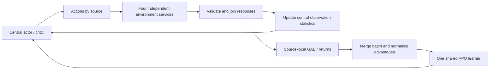

<h1 align="center"> UniDR </h1>

<h3 align="center">
Unified multi-simulator sampling and a shared PPO learner, built on UniLab
</h3>

<p align="center">Languages: English | <a href="README_zh.md">简体中文</a></p>

## Current scope and source availability

UniDR studies **simulator dynamics as a source of domain randomization**: how
training across different physics engines changes sim2sim and sim2real transfer
relative to a single engine. Current development targets **G1FlipTracking** with
Isaac Sim, Isaac Gym, Genesis, and Motrix feeding one shared PPO learner. MuJoCo
is reserved for fixed-model holdout evaluation; it does not supply training,
online scores, tuning feedback, or checkpoint selection.

**September 21, 2026: this update publishes documentation only.** The `src/` and
`vendor/` code in this GitHub repository still contains the September 13
**G1WalkFlat** snapshot. The flip implementation, adaptive allocation, and recent
Isaac Sim repair described below exist in the local development checkouts and
have not been synchronized into this source snapshot. A fresh clone cannot run
the new flip commands. Installing an upstream package with the same version
number does not supply these local changes.

| Artifact | Location and status |
| --- | --- |
| Published earlier experiment | [G1WalkFlat 10,000-update checkpoint](checkpoints/g1_walk_flat_multisim_10000/README.md) and [bundled dependencies](vendor/README.md) |
| Current task/config owner | Local `UniLab-unidr-backends`, base `b4e6b58fe0861a435fd19c0f0206bd84f4427a9c` plus local changes |
| Current RL runtime | Local `unilab_rl` / import `uni_rl`, base `79418e0cbff7b95fe6e49709b194454701ba20fa` plus local changes |
| Current physics adapters | Local `unisim-unidr-backends`, base `4270aa81d868744980db90dac6dd959d3f542f50` plus local changes |

The base commits alone do not reproduce the uncommitted implementation. The
active UniLab environment uses RSL-RL **5.0.1**; the runtime's separate 5.5.0
environment has also been tested. All flip commands below assume the three
modified checkouts, assets, and isolated vendor SDK environments are already
configured. Run them from `UniLab-unidr-backends`; `uv run --no-sync` preserves
the selected local dependencies. The [Chinese README](README_zh.md) provides
the longer experiment and interface description.

## Four-source architecture

Following PolySim's central-inference and synchronous-step organization, the
central actor/critic evaluates observations, splits actions by source, and waits
for all requested environment responses. Each source has its own process and
resident pool; Isaac SDKs retain separate vendor worker environments. Environment
services contain no policy copies or independent optimizers.



UniLab owns task configuration, Hydra/registry, `EnvFactory`, task metrics and
sim2sim. `uni_rl` owns collection/IPC, storage/GAE, the learner, probe orchestration,
scheduling, logs and recovery. UniSim owns physics adapters. Scripts orchestrate
these owners. Existing PPO and GAE are reused; PolySim's optimizer and older
timeout handling are not imported.

| Mode | Isaac Sim | Isaac Gym | Genesis | Motrix physics | Central inference and PPO |
| --- | --- | --- | --- | --- | --- |
| Single GPU | GPU 0 | GPU 0 | GPU 0 | CPU | GPU 0 |
| Four GPUs | GPU 0 | GPU 1 | GPU 2 | CPU | GPU 3 |

The fixed source order is Isaac Sim, Isaac Gym, Genesis, Motrix. At 1024
environments per source and 24 control steps, each iteration contains **98,304
transitions**. PPO performs **5 epochs × 4 minibatches = 20 optimizer steps**,
using the full batch in every epoch. The G1 has 29 DoF, actor/critic inputs of
160/286, 29 actions, and hidden layers of 512/256/128. Shared owners fix actions,
rewards, reference motion, assets, joint order and terminations. Robot
self-collision is disabled in all four sources; ground contacts remain enabled.
The current flip comparison profiles add no parameter DR.

Network weights remain fixed during collection. Native empirical normalizers
update once per actual post-step batch, including autoreset observations;
final observations are not counted again. Pure timeout bootstraps from the final
observation with that step's updated normalizer. True termination, including a
simultaneous timeout, does not bootstrap. Source tails use the window-end
normalizer. GAE is computed within each source's continuous trajectories before
merging, and statistics remain frozen during optimization. Raw rollout fields
and source/env/episode/segment/version identities are retained in memory, not
archived as a complete raw-data dump for every iteration.

## Fixed-share training

These commands target the local development implementation described above.
Check module origins before training; they must resolve to the modified
checkouts rather than this repository's older `vendor/` snapshot or PyPI wheels.

```bash
export UNIDR_DEV=/absolute/path/to/UniLab-unidr-backends
cd "$UNIDR_DEV"
export UNILAB_LOCAL_UNISIM=/absolute/path/to/unisim-unidr-backends
export OMP_NUM_THREADS=2 MKL_NUM_THREADS=2
uv run --no-sync python -c 'import unilab, uni_rl, unisim; print(unilab.__file__); print(uni_rl.__file__); print(unisim.__file__)'

# Single GPU, four sources at 25% each, fresh 5000-update run.
uv run --no-sync python "$UNIDR_DEV/scripts/train_unidr.py" \
  task=g1_flip_tracking/unidr_single_gpu \
  algo.num_envs=1024 algo.max_iterations=5000 \
  training.log_dir=/absolute/new/fixed-single-gpu

# Four-GPU device layout; physical execution on four GPUs remains unverified.
uv run --no-sync python "$UNIDR_DEV/scripts/train_unidr.py" \
  task=g1_flip_tracking/unidr_four_gpu \
  algo.num_envs=1024 algo.max_iterations=5000 \
  training.log_dir=/absolute/new/fixed-four-gpu
```

Both fixed owners default to 10000 updates, so the examples explicitly request
5000. For a real-backend smoke, use `algo.num_envs=2 algo.max_iterations=2` and a
new output directory: 192 transitions per iteration. Never reuse an existing
nonempty training directory.

A single-source comparison uses the native entrypoint, for example Genesis:

```bash
uv run --no-sync python -m unilab.training.single_comparison \
  genesis /absolute/new/genesis --num-envs 4096 --iterations 5000
uv run --no-sync train --algo ppo --task g1_flip_tracking \
  --sim genesis --profile comparison \
  algo.num_envs=4096 algo.max_iterations=5000 \
  training.device=cuda:0 training.log_dir=/absolute/new/genesis
uv run --no-sync python -m uni_rl.logging.single_run_audit \
  /absolute/new/genesis --expected-iterations 5000 --num-envs 4096
```

Replace `genesis` with `motrix`, `isaacgym`, or `isaacsim`. Single-source 4096 and
joint 4×1024 runs have the same global batch and, at 5000 updates, each consume
**491,520,000 transitions and 100,000 optimizer steps**. Joint training divides
those samples among the four sources. Single-source training does not enable
multi-source probes or allocation.

## Adaptive source allocation

The interface is implemented and tested locally; real adaptive PPO training at
4×1024 capacity remains unverified. Preview its config without creating physics:

```bash
uv run --no-sync python "$UNIDR_DEV/scripts/train_unidr.py" \
  task=g1_flip_tracking/unidr_adaptive --cfg job --resolve

# Enable adaptive allocation on one GPU.
uv run --no-sync python "$UNIDR_DEV/scripts/train_unidr.py" \
  task=g1_flip_tracking/unidr_adaptive \
  algo.num_envs=1024 algo.max_iterations=5000 \
  training.log_dir=/absolute/new/adaptive-single-gpu
```

Use `task=g1_flip_tracking/unidr_adaptive_four_gpu` for the four-GPU mapping.
The adaptive owner defaults to `unidr.adaptive.enabled=true`.
For a fixed-share control with the same probes and resets, use the same adaptive
owner with `unidr.adaptive.enabled=false`. This also freezes scheduler EMA,
metric weights and valid-probe counters, while probes and pool resets still run.
The original fixed owners have no periodic probes. PPO's adaptive KL learning
rate is separate from source-share adaptation.

Pool sizes stay fixed. The scheduler allocates **96 whole-pool control steps**:
initially `[24,24,24,24]`, with allocations such as `[25,24,24,23]`. Each wave
advances only sources with remaining quota; completed sources pause physics.
No samples are discarded or fabricated, and training/optimization budgets stay
constant. Only observations from active sources update normalization.

Every 100 completed iterations, a frozen-policy probe gives each environment
one first-episode opportunity: identical frame-zero reset, seed 1, zero extra
DR and 224 control steps / 4.48 seconds. The current task wrapper accepts one
225-frame, 50 FPS reference clip with start-frame sampling and no additional DR;
it is not a generic probe for arbitrary clips or randomized resets. Probe data
never enters training or normalizer statistics. Afterwards RNG/training counters
are restored and all pools reset into new episodes; previous physical states
are not restored.

| Metric | Fixed definition |
| --- | --- |
| E | Mean tracked-body world-position error; capped at 0.5 m per step, remaining failed steps padded with 0.5 m, then divided by 0.5 |
| S | Fraction surviving all 224 steps without native termination or timeout |
| R | First-episode return, remaining failed steps padded with zero; normalized to the shared fixed range `[0,38.08]` |

E/S/R use separate EMAs with alpha 0.2 and direct first-sample initialization.
Difficulty is `0.50E + 0.25(1-S) + 0.25(1-R)`, compared against a fixed equal-source
mean. A 0.02 deadband suppresses small differences. Bounded projection and integer
allocation enforce shares in `[0.10,0.70]` and changes of at most 0.02; at 96-step
granularity, each source can change by at most one step per scheduling update.
Metric-weight adaptation is separate and configurable: after all sources satisfy
the thresholds for three probes, transfer 0.01 failure weight to E per update,
retaining at least 0.05 failure weight. The scheduler itself preserves state on
invalid/missing scores. A real probe protocol or non-finite-data error instead
closes the environments and raises; invalid physics responses abort the window
without blindly retrying step.

Online S is **not** the holdout criterion of a complete flip followed by five
seconds without falling. MuJoCo never supplies online feedback. Fake sources
have verified actual PPO updates; the real adaptive interface check used four
2-env pools, 192 nonuniform samples and 224-step probes, with **zero optimizer
updates**. That check does not establish adaptive training success or capacity.

## Logs, checkpoints and recovery

`synchronous_metrics.jsonl` records global/source budgets, versions, actual
shares, losses and timing. Adaptive runs add probe metrics, EMA, weights and the
next allocation. TensorBoard provides source curves. `sources_manifest.json`
and `run_config.json` record task, algorithm, assets and configuration. Source
durations overlap and must not be summed as elapsed time.

Periodic checkpoints use zero-based names: `model_500.pt` contains 501 completed
updates; the fixed final model for 5000 updates is `model_4999.pt`. Saving is
allowed only after a complete iteration and any due probe/scheduling transaction.
State includes the model, optimizer, normalizers, RNG, versions, budgets and
applicable scheduling state. Resume into a new directory:

```bash
uv run --no-sync python "$UNIDR_DEV/scripts/train_unidr.py" \
  task=g1_flip_tracking/unidr_single_gpu \
  algo.num_envs=1024 algo.max_iterations=5000 \
  algo.resume=true algo.resume_path=/absolute/parent/model_500.pt \
  training.log_dir=/absolute/new/recovered
```

The target remains 5000 total updates. Recovery resets the four physical pools
into new episodes/generation. Adaptive recovery requires the original owner and
matching schedule contract; fixed checkpoints are not seamless adaptive resumes.
For a completed fixed run:

```bash
uv run --no-sync python ../unilab_rl/examples/report_synchronous.py \
  /absolute/completed/run /absolute/new/report \
  --expected-iterations 5000 --num-envs 1024
```

This report produces an independent budget audit and learning/timing curves.
The fixed-budget report and dedicated holdout auditor do **not** yet support
adaptive checkpoints. MuJoCo playback validates the fixed final model and strict
policy/asset contract before environment creation; it does not pick checkpoints.

## Recent progress and remaining validation

- **September 20:** adaptive allocation, independent probes, EMA/metric weights
  and boundary recovery were implemented. Runtime suites passed under RSL-RL
  5.0.1 and 5.5.0: 665 passed, 40 skipped, 3 deselected in each environment.
  No formal adaptive training was launched.
- **September 21:** repaired Isaac Sim's duplicated infinite ground planes when
  cloning environments. In the 4096-env, 32-step zero-action probe, early
  terminations fell from 3763 to zero. Rewards, actions, PPO and termination
  thresholds were unchanged; native logs are retained and explicit physics
  errors fail the run.
- Repaired single Isaac Sim **4096×5000** completed and passed budget and final
  native-log audits. Genesis, Motrix and Isaac Gym **4096×5000** single-source
  runs also completed.
- Repaired fixed joint **4×1024×5000** training remains in progress. The recorded
  3501-update checkpoint audit passed: 344,162,304 transitions and 70,020 optimizer
  steps. This is an intermediate snapshot, not final completion.
- Four-GPU validation covers device mapping only. Real adaptive training and
  1024-env-per-source adaptive capacity remain unverified. Current deterministic
  MuJoCo trials did not meet the full-flip-plus-five-second-stability criterion;
  training completion is not transfer success or evidence of sim2real benefit.

Earlier joint runs used only 1024 Isaac Sim environments; their retained logs
did not show the 4096-env capacity failure. The single-source defect does not
invalidate every historical joint run. Budget correctness, native task success,
sim2sim performance and sim2real results remain separate evidence levels.

## Upstream UniLab

The original UniLab introduction, installation links, license and citation are
retained below. Upstream features do not imply that the local UniDR flip changes
are included in this repository. For the published WalkFlat snapshot, use the
checkpoint and vendor instructions linked above.

<p align="center">
  <a href="https://github.com/unilabsim/UniLab/actions/workflows/ci.yml"></a>
  <a href="https://unilabsim.github.io"></a>
  <a href="https://arxiv.org/abs/2605.30313"></a>
  <a href="https://arxiv.org/abs/2605.30313"></a>
  <a href="https://unilabsim.github.io/UniLab-doc/"></a>
  <a href="https://pypi.org/project/unilab/"></a>
  <a href="https://github.com/unilabsim/UniLab/blob/main/LICENSE"></a>
</p>

<h3 align="center">🎉 🎉 UniLab has been accepted to <b>CoRL 2026</b>! 🎉 🎉</h3>

<p align="center">
  
</p>

<p align="center"><em>One task-authoring surface for locomotion, manipulation, and motion tracking.</em></p>

UniLab is configurable infrastructure for robot reinforcement learning.
Describe a task with Hydra, assemble it from manager terms, select a physics
backend, and train or evaluate through one CLI. The same task-facing contract
connects CPU, GPU, and external-worker simulation to the learner runtime.

The same framework has documented paths for Windows, Apple Silicon macOS, Linux
CUDA, AMD ROCm, and Intel XPU. Backend and task maturity are evidence-graded;
use the [support matrix](https://unilabsim.github.io/UniLab-doc/en/5-reference/5-support_matrix.html)
to choose a tested combination.

See policies in action on the [project page](https://unilabsim.github.io/#demos),
or read [Why UniLab?](https://unilabsim.github.io/UniLab-doc/en/why_unilab.html)
to understand the project fit, evidence, and comparison with alternatives.

## Highlights

UniLab's core idea is simple: define task semantics once as reusable
configuration, then change the simulator, hardware, or learner without
rewriting the task's environment lifecycle.

- **Configure, don't code.** Actions, observations, rewards, terminations,
  events, commands, curricula, and metrics are manager terms assembled in Hydra
  owner YAML. Variants built from existing terms need no new environment class
  — often no Python code at all.
- **Change the backend, keep the workflow.** Registered simulators meet the
  public `SimBackend` contract. Choose a backend with `--sim`; when a matching
  task owner exists, task authoring and train/eval stay consistent while
  backend-specific details remain explicit.
- **Keep solver and learner devices independent.** CPU-parallel, native, or
  external-worker simulation can feed an accelerator learner without first
  becoming a CUDA-resident simulator. The learner can run on CUDA, ROCm, MPS,
  or XPU; the [support matrix](https://unilabsim.github.io/UniLab-doc/en/5-reference/5-support_matrix.html)
  records the evidence level of each backend/task combination.
- **Accelerate replay-based off-policy training.** FastSAC/FlashSAC lets
  simulation data collection overlap with learner updates. The paper reports
  3–10× end-to-end gains on representative configurations; see [Why UniLab](https://unilabsim.github.io/UniLab-doc/en/why_unilab.html)
  for scope and measurements.

## Quick start

The supported source workflow uses [`uv`](https://docs.astral.sh/uv/). This is
the shortest path to a policy demo:

```bash
curl -LsSf https://astral.sh/uv/install.sh | sh
git clone https://github.com/unilabsim/UniLab.git
cd UniLab

make setup
# Downloads the checkpoint and assets from Hugging Face on first run.
uv run demo dance
```

For Windows, macOS, CUDA, ROCm, XPU, optional backends, and headless rendering,
use the [installation guide](https://unilabsim.github.io/UniLab-doc/en/1-getting_started/2-installation.html)
and [quick demo guide](https://unilabsim.github.io/UniLab-doc/en/1-getting_started/1-quick_demo.html).

## Train and evaluate

```bash
# Train and replay one task with Motrix.
uv run train --algo ppo --task go2_joystick_flat --sim motrix
uv run eval --algo ppo --task go2_joystick_flat --sim motrix --load-run -1

# Use the same task-facing command with another configured backend.
uv run train --algo ppo --task go2_joystick_flat --sim mujoco

# Replay-based off-policy path.
uv run train --algo sac --task g1_walk_flat --sim mujoco
```

The flags keep algorithm, task, and simulator choices visible. Resume, W&B,
Hydra overrides, playback, backend setup, and the full command matrix belong in
the [training guide](https://unilabsim.github.io/UniLab-doc/en/2-user_guide/1-training/0-index.html),
[backend guide](https://unilabsim.github.io/UniLab-doc/en/2-user_guide/3-backends/0-index.html),
and [support matrix](https://unilabsim.github.io/UniLab-doc/en/5-reference/5-support_matrix.html).

## Ecosystem

UniLab is designed to be a shared task and training surface for robot-specific
repositories. They can ship robot recipes independently while consuming the
same task, backend, and RL contracts. Current downstream examples:

- [MicroDuck RL](https://github.com/unilabsim/microduck_rl_unilab)
- [EngineAI RL](https://github.com/unilabsim/engineai_rl_unilab)
- [Wuji](https://github.com/unilabsim/wuji_unilab)
- [Legged Manipulation](https://github.com/unilabsim/legged-manipulation_unilab)

## Documentation

- [Why UniLab?](https://unilabsim.github.io/UniLab-doc/en/why_unilab.html)
- [Installation and first demo](https://unilabsim.github.io/UniLab-doc/en/1-getting_started/0-index.html)
- [Training and evaluation](https://unilabsim.github.io/UniLab-doc/en/2-user_guide/1-training/0-index.html)
- [Backend support matrix](https://unilabsim.github.io/UniLab-doc/en/5-reference/5-support_matrix.html)
- [Sim-to-sim deployment](https://unilabsim.github.io/UniLab-doc/en/3-deployment/2-sim_to_sim/1-backend_swap.html)
- [Developer guide](https://unilabsim.github.io/UniLab-doc/en/4-developer_guide/0-index.html)

For development and contribution workflows, see the
[contributing guide](CONTRIBUTING.md).

## Community

<p align="center">
  
</p>

<p align="center">Add the UniLab assistant on WeChat to join the community.</p>

## Citation

```bibtex
@article{jia2026unilab,
  title         = {UniLab: A Heterogeneous Architecture for Robot RL Beyond GPU-Dominant Paradigms},
  author        = {Jia, Yufei and Cao, Zhanxiang and Yu, Mingrui and Zhang, Heng and Chen, Shenyu and Jiang, Dixuan and Li, Meng and Li, Xiaofan and Liu, Yiyang and Wu, Junzhe and Li, Zheng and Fang, XiLin and Cui, Tingyu and Fu, Shengcheng and Li, Haoyang and Wang, Anqi and Wang, Zifan and Zhu, Dongjie and Cao, Chenyu and Huang, Zhenbiao and Zheng, Ziang and Lu, Jie and Ma, Xin and Wei, Zhengyang and Zhao, Xiang and Zhan, Tianyue and He, Ye and Chen, Yuxiang and Jiang, Yizhou and Li, Yue and Ge, Haizhou and Dong, Yuhang and Jia, Fan and Zhang, Ziheng and Zhang, Meng and Deng, Xiwa and Chen, Zhixing and Shao, Hanyang and Dong, Chenxin and Li, Yixuan and Chen, Yizhi and Chen, Bokui and Zhang, Kaifeng and Cui, Hanqing and Qin, Yusen and Huang, Ruqi and Han, Lei and Wang, Tiancai and Li, Xiang and Gao, Yue and Zhou, Guyue},
  journal       = {arXiv preprint arXiv:2605.30313},
  year          = {2026},
  url           = {https://arxiv.org/abs/2605.30313}
}
```

UniLab is released under the [Apache License 2.0](LICENSE). See the
independent [UniSim](https://github.com/unilabsim/unisim) and
[UniLab RL](https://github.com/unilabsim/unilab_rl) repositories for their
own release and citation information.

## Acknowledgments

UniLab would not exist without the excellent work of the
[Isaac Lab](https://github.com/isaac-sim/IsaacLab) team and the
[mjlab](https://github.com/mujocolab/mjlab) developers and contributors. Isaac
Lab's manager-based API design and abstractions, together with mjlab's clear,
lightweight reference implementation, helped shape UniLab's Hydra and NumPy
task authoring experience. We sincerely thank both communities for sharing
their work and ideas.
