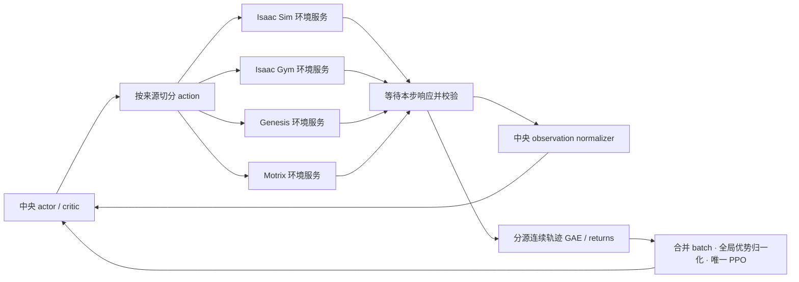

<h1 align="center"> UniDR </h1>

<h3 align="center">
基于 UniLab 的多仿真器统一采样与共享 PPO
</h3>

<p align="center">语言：简体中文 | <a href="README.md">English</a></p>

## 当前版本与研究范围

UniDR 研究把**仿真器动力学差异作为域随机化来源**，比较单仿真器与多仿真器
共同训练对 sim2sim / sim2real 的影响。当前开发任务是 **G1FlipTracking**：
Isaac Sim、Isaac Gym、Genesis、Motrix 采集，唯一共享 PPO learner 更新。
MuJoCo 仅用于固定模型留出测试，不进入训练、在线评分、调参或 checkpoint 选择。

**版本边界（2026-09-21）：本次更新发布文档。** 本仓当前 `src/` 与 `vendor/`
仍是 9 月 13 日的 **G1WalkFlat** 快照；下述 G1 flip、自适应配比和 Isaac Sim
修复位于本地开发分支，尚未同步到这个 GitHub 源码快照。不能仅克隆本仓就执行
这些新命令，也不能用上游同版本号的 PyPI 包替代修改后的 runtime。

| 内容 | 位置及状态 |
| --- | --- |
| 本仓已包含的旧实验 | [G1WalkFlat 10,000 轮 checkpoint](checkpoints/g1_walk_flat_multisim_10000/README.md)、[单仓依赖](vendor/README.md) |
| 当前 flip 环境与配置 | 本地 `UniLab-unidr-backends`；基线 `b4e6b58fe0861a435fd19c0f0206bd84f4427a9c` 加本地修改 |
| 当前 RL runtime | 本地 `unilab_rl`，导入名 `uni_rl`；基线 `79418e0cbff7b95fe6e49709b194454701ba20fa` 加本地修改 |
| 当前物理后端 | 本地 `unisim-unidr-backends`；基线 `4270aa81d868744980db90dac6dd959d3f542f50` 加本地修改 |

基线 SHA 不能单独复现未提交修改。当前开发环境实际使用 RSL-RL **5.0.1**；
runtime 自身锁文件的 5.5.0 是另一个已测试环境。以下命令均针对**已配置好的
本地开发三仓**，从 `UniLab-unidr-backends` 根目录执行；SDK 和机器人/动作资产
必须已准备好，不会随 README 自动安装。`uv run --no-sync` 保留本地 editable 依赖。

## 四后端如何联合

借鉴 PolySim 的中央推理和逐步同步采样组织方式，复用 `uni_rl` 现有 PPO、GAE
和 final observation 处理，不复制 PolySim 的优化器或旧 timeout 逻辑。



四源各有独立进程和常驻环境池，Isaac SDK 继续运行在独立 vendor worker 环境中。
环境服务不训练策略。UniLab 负责任务、Hydra/registry、`EnvFactory`、任务指标和
sim2sim；`uni_rl` 负责中央推理、采集/IPC、storage/GAE、learner、probe 编排、
调度、日志和恢复；UniSim 负责物理后端。scripts 只编排。

| 模式 | Isaac Sim | Isaac Gym | Genesis | Motrix 物理 | 中央推理与 PPO |
| --- | --- | --- | --- | --- | --- |
| 单 GPU | GPU 0 | GPU 0 | GPU 0 | CPU | GPU 0 |
| 四 GPU | GPU 0 | GPU 1 | GPU 2 | CPU | GPU 3 |

来源顺序固定为 Sim、Gym、Genesis、Motrix。默认每源 1024 环境，每源每轮
采集 24 步：**98,304 transitions / iteration**；5 epochs × 4 minibatches，
**20 次优化**，每个 epoch 使用全部样本。四源同时驻留，不串行轮训四个模型。
G1 为 29 DoF，actor/critic 输入 160/286，动作 29，网络 512/256/128。
动作缩放、奖励、参考动作、资产和关节顺序由共同 owner 固定；四源关闭自碰撞，
保留机器人与地面的碰撞。当前 flip 配置未启用额外参数 DR。

窗口内网络权重不变；normalizer 保留原生逐步经验统计，每次仅累计真正推进的
post-step observation，包含 autoreset observation，final observation 不重复计数。
纯 timeout 用本步更新后的 normalizer 对 final observation bootstrap；真正终止
与双标记不 bootstrap。先在每源连续轨迹内计算 GAE，再合并；优化时冻结统计。
原始 rollout 字段和来源/env/episode/segment/版本在内存 window/storage 中保留，
不意味着每轮全部原始数据都写入磁盘。

## 固定比例训练

先确认三个模块解析到当前开发 checkout，而不是本仓旧 `vendor/` 或 PyPI 包：

```bash
export UNIDR_DEV=/absolute/path/to/UniLab-unidr-backends
cd "$UNIDR_DEV"
export UNILAB_LOCAL_UNISIM=/absolute/path/to/unisim-unidr-backends
export OMP_NUM_THREADS=2 MKL_NUM_THREADS=2
uv run --no-sync python -c 'import unilab, uni_rl, unisim; print(unilab.__file__); print(uni_rl.__file__); print(unisim.__file__)'

# 单卡：4 × 1024 环境，固定各 25%，从头训练 5000 轮。
uv run --no-sync python "$UNIDR_DEV/scripts/train_unidr.py" \
  task=g1_flip_tracking/unidr_single_gpu \
  algo.num_envs=1024 algo.max_iterations=5000 \
  training.log_dir=/absolute/new/fixed-single-gpu
```

四卡将 task 改为 `g1_flip_tracking/unidr_four_gpu`，输出目录换成新的路径。
这两个 owner 原默认为 10000 轮，因此上面显式覆盖为 5000。小规模真实 smoke
可改成 `algo.num_envs=2 algo.max_iterations=2`，每轮仍为 192 条样本。
训练目录不能和已有实验混用。四卡设备映射已测试，四卡实机尚未验证。

单源对照使用相同 comparison owner，例如 Genesis：

```bash
uv run --no-sync python -m unilab.training.single_comparison \
  genesis /absolute/new/genesis --num-envs 4096 --iterations 5000
uv run --no-sync train --algo ppo --task g1_flip_tracking \
  --sim genesis --profile comparison \
  algo.num_envs=4096 algo.max_iterations=5000 \
  training.device=cuda:0 training.log_dir=/absolute/new/genesis
uv run --no-sync python -m uni_rl.logging.single_run_audit \
  /absolute/new/genesis --expected-iterations 5000 --num-envs 4096
```

`genesis` 可替换为 `motrix`、`isaacgym`、`isaacsim`。单源 4096 与联合 4×1024
的每轮全局 batch 相同，各 5000 轮均为 **491,520,000 transitions / 100,000
optimizer steps**；联合每源仅贡献总样本的 25%。不要和旧的单源 1024 环境实验
仅按轮数混比。单源不会开启多源 probe 或自适应配比。

## 开启自适应来源比例

```bash
# 只解析配置，不构建环境。
uv run --no-sync python "$UNIDR_DEV/scripts/train_unidr.py" \
  task=g1_flip_tracking/unidr_adaptive --cfg job --resolve

# 可执行入口；当前尚未完成真实自适应 PPO 训练/1024容量验证。
uv run --no-sync python "$UNIDR_DEV/scripts/train_unidr.py" \
  task=g1_flip_tracking/unidr_adaptive \
  algo.num_envs=1024 algo.max_iterations=5000 \
  training.log_dir=/absolute/new/adaptive-single-gpu
```

此 owner 默认 `unidr.adaptive.enabled=true`，即开启自适应来源比例。
四卡 owner 是 `g1_flip_tracking/unidr_adaptive_four_gpu`。公平固定比例控制组
使用相同 owner 加 `unidr.adaptive.enabled=false`：**仍保留 probe 和周期性全池
reset**，保持等额采集并停止调度状态更新（包括 EMA、指标权重与有效 probe 计数）。
原 `unidr_single_gpu/four_gpu` 没有这些 probe/reset。
PPO 的 adaptive KL 学习率与来源比例自适应是两个独立机制。

每源池容量不变，分配的是总计 **96 个整池控制步**：初始 `[24,24,24,24]`，
也可为 `[25,24,24,23]`。每个 wave 只推进仍有配额的来源，采满即暂停该源物理，
不事后丢样、不补零、不热改环境数量；总训练样本和优化预算保持不变。

每完成 100 轮，在四个训练后端冻结策略及统计做独立 probe：相同 frame 0、
seed 1、零附加 DR、224 控制步 / 4.48 秒，每环境仅首 episode 计一次机会。
probe 不进入训练和 normalizer；之后恢复 RNG/训练计数并全池 reset 到新 episode，
不宣称恢复之前的仿真物理状态。
当前 probe 只接受这一份 225 帧、50 FPS、从 frame 0 开始且无额外 DR 的动作配置；
任意动作片段或参数 DR 的通用评测入口尚未实现。

| 指标 | 固定定义 |
| --- | --- |
| E | 跟踪身体世界位置误差，逐步上限 0.5 m；失败余步补 0.5 m，时域均值除以 0.5 |
| S | 224 步未触发原生 terminated/truncated 的环境比例 |
| R | 首 episode 原始回报，失败余步补零；共同固定尺度 `[0,38.08]` 归一化 |

三指标分别 EMA，alpha=0.2，首次直接初始化。困难度
`D = 0.50E + 0.25(1−S) + 0.25(1−R)`，比较基准始终四源等权。
噪声门槛 0.02，困难来源增配；有界配平和整数求解保证总量不变、比例
`[0.10,0.70]`、每次变化不超过 0.02。96 步粒度下，每源每次实际最多改变一步。
E/S/R 全部连续三次达标后，可逐次把 0.01 失败率权重转给 E，失败率权重最低
0.05；门槛及速度均在 YAML 中配置。调度器函数遇无效/缺测评分保持原状态；
真实 probe 的协议/数据异常以及错误物理响应会中止运行，不盲目重试有状态 step。

在线 S **不是“动作完成后 5 秒不摔倒”成功率**。后者是单独的留出评测标准。
目前已验证 fake 四进程真实 PPO 更新；真实接口 smoke 做过四源各 2 环境、
非均匀 192 条采集和各 224 步 probe，**optimizer 更新为 0**。
真实自适应训练、每源1024容量、四卡实机和性能收益均待验证。

## 日志、保存与恢复

`synchronous_metrics.jsonl` 保存全局/分源预算、版本、实际比例、损失和耗时；
自适应模式增加 probe、EMA、指标权重和下轮配额。TensorBoard 提供分源曲线。
`sources_manifest.json` 与 `run_config.json` 保存任务、算法、资产及配置指纹。
来源耗时存在重叠，不能直接相加当墙钟时间。

每 500 轮保存，文件名采用零起点：`model_500.pt` 对应完成 501 次更新；5000
轮固定最终模型为 `model_4999.pt`。只在完整 iteration 及到期 probe/调度结束后
保存模型、optimizer、normalizer、RNG、版本、预算和调度状态。

```bash
uv run --no-sync python "$UNIDR_DEV/scripts/train_unidr.py" \
  task=g1_flip_tracking/unidr_single_gpu \
  algo.num_envs=1024 algo.max_iterations=5000 \
  algo.resume=true algo.resume_path=/absolute/parent/model_500.pt \
  training.log_dir=/absolute/new/recovered
```

恢复后四源环境重新 reset、进入新 generation；不恢复真实仿真状态。
自适应恢复必须使用原 owner 和相同调度契约，不能直接续接固定模式 checkpoint。
当前固定模式报告器 `../unilab_rl/examples/report_synchronous.py` 和专用 holdout
预算审计器尚不支持自适应 checkpoint，不能用固定配额假设强行审计。

## 最近改动与进展

- **9 月 20 日**：完成自适应接口、整数配额、独立 probe、EMA/指标权重和边界
  恢复；RSL-RL 5.0.1 / 5.5.0 两套 runtime 测试均为 665 passed、40 skipped、
  3 deselected。未启动正式自适应训练。
- **9 月 21 日**：修复 Isaac Sim 克隆重复无限地面导致的 PhysX 交互容量问题。
  4096 环境零动作 32 步，修前 3763 提前终止，修后 0；未改奖励、动作、PPO 或
  终止阈值。新增持久原生日志与明确物理错误拒绝。
- 修复后单 Isaac Sim **4096×5000** 已完成并通过预算及完整退出日志审计。
  Genesis、Motrix、Isaac Gym 的单源 **4096×5000** 也已完成。
- 修复版固定联合 **4×1024×5000** 正在运行；已保存的 3501 次更新审计通过，
  对应 344,162,304 transitions、70,020 次优化。这是阶段快照，非最终完成声明。
- 四卡仅完成映射测试。本轮 MuJoCo 固定场景各十次测试按“完整空翻且动作后
  5 秒不摔倒”均为 0/10；修复 Isaac Sim 能翻转落地，但后续失稳。确定性重复
  不是十种随机条件，不据此声称 sim2real 或随机鲁棒性结论。

历史联合中 Isaac Sim 每源只有 1024；保存日志未出现单源4096的容量故障，
不能据单源错误否定全部历史联合实验。训练预算正确、原生动作成功、sim2sim
成功和 sim2real 有效是不同验收项。当前目标是完成修复版固定训练，再按预先
约定的协议比较；MuJoCo 结果不驱动在线配比或选择 checkpoint。

## 上游 UniLab

以下保留 UniLab 的介绍、安装入口及引用信息。上游功能说明不代表本地 UniDR
开发改动已经发布；旧 WalkFlat 实验安装仍见上面的 checkpoint 与 vendor 文档。

<p align="center">
  <a href="https://github.com/unilabsim/UniLab/actions/workflows/ci.yml"></a>
  <a href="https://unilabsim.github.io"></a>
  <a href="https://arxiv.org/abs/2605.30313"></a>
  <a href="https://arxiv.org/abs/2605.30313"></a>
  <a href="https://unilabsim.github.io/UniLab-doc/"></a>
  <a href="https://pypi.org/project/unilab/"></a>
  <a href="https://github.com/unilabsim/UniLab/blob/main/LICENSE"></a>
</p>

<h3 align="center">🎉 🎉 UniLab 已被 <b>CoRL 2026</b> 接收！ 🎉 🎉</h3>

<p align="center">
  
</p>

<p align="center"><em>用同一套任务编排体验覆盖运动、操作与动作跟踪。</em></p>

UniLab 是面向机器人强化学习的可配置基础设施。使用 Hydra 描述任务，
通过 manager term 组装任务，选择物理后端，再用统一 CLI 完成训练与评估。
同一套面向任务的 contract 可以把 CPU、GPU 和外部 worker 仿真连接到学习器运行时。

同一套框架已提供 Windows、Apple Silicon macOS、Linux CUDA、AMD ROCm 和 Intel XPU 的文档
路径。不同 backend/task 的成熟度按证据分级；请选择[支持矩阵](https://unilabsim.github.io/UniLab-doc/zh_CN/5-reference/5-support_matrix.html)
中有测试证据的组合。

可以先在[项目主页](https://unilabsim.github.io/#demos)观看策略运行，或阅读
[为什么选择 UniLab？](https://unilabsim.github.io/UniLab-doc/zh_CN/why_unilab.html)，
了解适用场景、证据和同类方案比较。

## 亮点

UniLab 的核心理念很简单：将任务语义定义为可复用的配置，然后独立更换仿真器、硬件或
learner，而无需重写任务的 environment 生命周期。

- **配置而非编码。** action、observation、reward、termination、event、command、
  curriculum 和 metrics 都是 manager term，在 Hydra owner YAML 中组装。基于已有 term
  的任务变体无需新写 environment class，很多时候完全不需要 Python 代码。
- **更换后端而不更换工作流。** 已注册仿真器遵循公开的 `SimBackend` contract。
  使用 `--sim` 选择后端；存在匹配 task owner 时，任务编排和训练/评估工作流保持一致，
  后端差异仍然显式。
- **让 solver 与 learner 的设备彼此独立。** CPU 并行、native 或 external-worker 仿真
  不必先变成 CUDA-resident simulator，也可以向 accelerator learner 提供数据；learner
  可以运行在 CUDA、ROCm、MPS 或 XPU 上。每个 backend/task 组合的证据等级请查看
  [支持矩阵](https://unilabsim.github.io/UniLab-doc/zh_CN/5-reference/5-support_matrix.html)。
- **加速 replay-based off-policy 训练。** FastSAC/FlashSAC 让仿真数据采集与 learner
  update 重叠。论文在代表性配置上报告了 3–10 倍端到端收益；测量范围和限制见
  [为什么选择 UniLab](https://unilabsim.github.io/UniLab-doc/zh_CN/why_unilab.html)。

## 快速开始

推荐使用 [`uv`](https://docs.astral.sh/uv/) 完成源码工作流。以下是运行策略 demo 的
最短路径：

```bash
curl -LsSf https://astral.sh/uv/install.sh | sh
git clone https://github.com/unilabsim/UniLab.git
cd UniLab

make setup
# 首次运行会从 Hugging Face 下载 checkpoint 和 asset。
uv run demo dance
```

Windows、macOS、CUDA、ROCm、XPU、可选后端和无头渲染的说明，请查看
[安装指南](https://unilabsim.github.io/UniLab-doc/zh_CN/1-getting_started/2-installation.html)和
[快速演示指南](https://unilabsim.github.io/UniLab-doc/zh_CN/1-getting_started/1-quick_demo.html)。

## 训练与评估

```bash
# 使用 Motrix 训练并回放一个任务。
uv run train --algo ppo --task go2_joystick_flat --sim motrix
uv run eval --algo ppo --task go2_joystick_flat --sim motrix --load-run -1

# 使用另一个已有配置的后端，保持同样的任务入口。
uv run train --algo ppo --task go2_joystick_flat --sim mujoco

# Replay-based off-policy 路径。
uv run train --algo sac --task g1_walk_flat --sim mujoco
```

这些 flag 会让 algorithm、task 和 simulator 选择保持可见。续训、W&B、Hydra override、
回放、后端安装和完整命令矩阵属于
[训练指南](https://unilabsim.github.io/UniLab-doc/zh_CN/2-user_guide/1-training/0-index.html)、
[后端指南](https://unilabsim.github.io/UniLab-doc/zh_CN/2-user_guide/3-backends/0-index.html)和
[支持矩阵](https://unilabsim.github.io/UniLab-doc/zh_CN/5-reference/5-support_matrix.html)。

## 生态

UniLab 被设计为机器人专属仓库共享的任务与训练界面。下游仓库可以独立发布机器人
recipe，同时消费同一套 task、backend 和 RL contract。目前的下游示例：

- [MicroDuck RL](https://github.com/unilabsim/microduck_rl_unilab)
- [EngineAI RL](https://github.com/unilabsim/engineai_rl_unilab)
- [Wuji](https://github.com/unilabsim/wuji_unilab)
- [Legged Manipulation](https://github.com/unilabsim/legged-manipulation_unilab)

## 文档

- [为什么选择 UniLab？](https://unilabsim.github.io/UniLab-doc/zh_CN/why_unilab.html)
- [安装与第一次 demo](https://unilabsim.github.io/UniLab-doc/zh_CN/1-getting_started/0-index.html)
- [训练与评估](https://unilabsim.github.io/UniLab-doc/zh_CN/2-user_guide/1-training/0-index.html)
- [后端支持矩阵](https://unilabsim.github.io/UniLab-doc/zh_CN/5-reference/5-support_matrix.html)
- [Sim-to-sim 部署](https://unilabsim.github.io/UniLab-doc/zh_CN/3-deployment/2-sim_to_sim/1-backend_swap.html)
- [开发者指南](https://unilabsim.github.io/UniLab-doc/zh_CN/4-developer_guide/0-index.html)

开发与贡献工作流请参阅[贡献指南](CONTRIBUTING.md)。

## 社区

<p align="center">
  
</p>

<p align="center">添加 UniLab 小助手微信，加入社区。</p>

## 引用

```bibtex
@article{jia2026unilab,
  title         = {UniLab: A Heterogeneous Architecture for Robot RL Beyond GPU-Dominant Paradigms},
  author        = {Jia, Yufei and Cao, Zhanxiang and Yu, Mingrui and Zhang, Heng and Chen, Shenyu and Jiang, Dixuan and Li, Meng and Li, Xiaofan and Liu, Yiyang and Wu, Junzhe and Li, Zheng and Fang, XiLin and Cui, Tingyu and Fu, Shengcheng and Li, Haoyang and Wang, Anqi and Wang, Zifan and Zhu, Dongjie and Cao, Chenyu and Huang, Zhenbiao and Zheng, Ziang and Lu, Jie and Ma, Xin and Wei, Zhengyang and Zhao, Xiang and Zhan, Tianyue and He, Ye and Chen, Yuxiang and Jiang, Yizhou and Li, Yue and Ge, Haizhou and Dong, Yuhang and Jia, Fan and Zhang, Ziheng and Zhang, Meng and Deng, Xiwa and Chen, Zhixing and Shao, Hanyang and Dong, Chenxin and Li, Yixuan and Chen, Yizhi and Chen, Bokui and Zhang, Kaifeng and Cui, Hanqing and Qin, Yusen and Huang, Ruqi and Han, Lei and Wang, Tiancai and Li, Xiang and Gao, Yue and Zhou, Guyue},
  journal       = {arXiv preprint arXiv:2605.30313},
  year          = {2026},
  url           = {https://arxiv.org/abs/2605.30313}
}
```

UniLab 以 [Apache License 2.0](LICENSE) 发布。独立的
[UniSim](https://github.com/unilabsim/unisim) 与
[UniLab RL](https://github.com/unilabsim/unilab_rl) 仓库包含各自的发布和引用信息。

## 致谢

如果没有 [Isaac Lab](https://github.com/isaac-sim/IsaacLab) 团队以及
[mjlab](https://github.com/mujocolab/mjlab) 开发团队和贡献者的出色工作，UniLab 不会
成为今天的样子。Isaac Lab 在 manager-based API 设计和抽象方面的工作，以及 mjlab
清晰、轻量的参考实现，共同塑造了 UniLab 的 Hydra + NumPy 任务编排体验。衷心感谢两个
社区分享他们的工作与想法。
