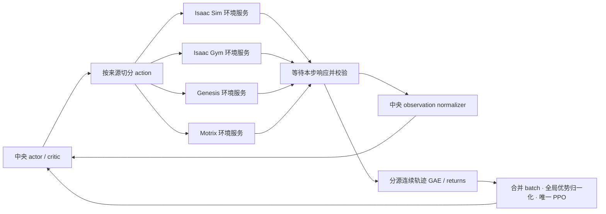

<h1 align="center"> UniDR </h1>

<h3 align="center">
G1 flip tracking：四仿真器统一采样与唯一共享 PPO
</h3>

<p align="center">语言：简体中文 | <a href="README.md">English</a></p>

## 当前版本与研究范围

UniDR 研究把**仿真器动力学差异作为域随机化来源**，比较单仿真器与多仿真器
共同训练对 sim2sim / sim2real 的影响。任务为 **G1FlipTracking**：
Isaac Sim、Isaac Gym、Genesis、Motrix 采集，唯一共享 PPO learner 更新。
MuJoCo 仅用于固定模型留出测试，不进入训练、在线评分、调参或 checkpoint 选择。
后续开发与实验以 flip tracking 为中心。

本仓已包含 flip 任务配置、中央 rollout、共享 PPO、自适应比例接口和最近的
Isaac Sim 地面克隆修复。修改后的两个依赖随仓提供，仍保留独立 Python 包边界：

| Owner | 仓内位置 | 本地修改之前的上游基线 |
| --- | --- | --- |
| UniLab：任务、配置、环境工厂、sim2sim | [src/unilab](src/unilab) | `b4e6b58fe0861a435fd19c0f0206bd84f4427a9c` |
| uni_rl：采集、learner、IPC、调度、日志 | [vendor/unilab_rl](vendor/unilab_rl) | `79418e0cbff7b95fe6e49709b194454701ba20fa` |
| UniSim：物理适配与 vendor worker | [vendor/unisim](vendor/unisim) | `4270aa81d868744980db90dac6dd959d3f542f50` |

基线 SHA 不能单独标识修改后的实现。逐文件哈希、打包改动和检查结果见
[源码清单](vendor/manifest.json)及
[本次发布验证](docs/validation/unidr-flip-publication-2026-09-21.md)。
根目录锁文件使用 RSL-RL **5.0.1**；runtime 独立锁文件使用 5.5.0。
下面的工作流统一使用根目录环境。

## 安装、SDK 与资产

当前实验环境为 Linux、RTX 3090、Python 3.10、PyTorch 2.8.0+cu128。
安装 [uv](https://docs.astral.sh/uv/) 后，从本仓同时安装三个 editable 包：

```bash
git clone https://github.com/wang-sm520/UniDR.git
cd UniDR
uv sync --python 3.10 --locked --extra mujoco --extra motrix --extra genesis
uv run --no-sync python -c 'import unilab, uni_rl, unisim; print(unilab.__file__); print(uni_rl.__file__); print(unisim.__file__)'
uv run --no-sync unilab-pull-assets --robot g1
uv run --no-sync python -c 'from unilab.assets.hub import resolve_motion_files; resolve_motion_files("motions/g1/flip_360_001__A304.npz")'
export OMP_NUM_THREADS=2 MKL_NUM_THREADS=2
```

`unilab` 应来自本仓 `src/`，`uni_rl` / `unisim` 应来自本仓 `vendor/`。
上游同版本号 wheel 不包含这些实验修改。mesh、贴图和动作通过注册的
Hugging Face 资产 hub 下载，不提交到 git；训练检查固定动作与 G1 XML 哈希。

Isaac Gym Preview 4 使用独立 Python 3.8 环境；Isaac Sim 5.1 / IsaacLab 使用独立
Python 3.11 环境。它们不由根目录 `uv sync` 安装，也不随仓分发。
已有安装默认位于 `~/.cache/unisim/isaacgym` 与 `~/.cache/unisim/isaacsim`；
自定义位置可设置 `UNISIM_ISAACGYM_HOME`、`UNISIM_ISAACSIM_HOME`，解释器可设置
`UNISIM_ISAACGYM_PYTHON`、`UNISIM_ISAACSIM_PYTHON`。
新机器安装前阅读
[Isaac Gym 脚本](scripts/tools/setup_isaacgym_env.sh)和
[Isaac Sim 脚本](scripts/tools/setup_isaacsim_env.sh)。
worker 源码从当前导入的 vendor UniSim 路径加载。

以下命令均从 UniDR 根目录执行；`/absolute/...` 是需要替换的路径占位符。
新输出目录不得混用已有实验。

## 四后端如何联合

借鉴 PolySim 的中央推理和逐步同步采样组织方式，复用 `uni_rl` 现有 PPO、GAE
和 final observation 处理，不复制 PolySim 的优化器或旧 timeout 逻辑。



四源各有独立进程和常驻环境池，Isaac SDK 继续运行在独立 vendor worker 环境中。
环境服务不训练策略。UniLab 负责任务、Hydra/registry、`EnvFactory`、任务指标和
sim2sim；`uni_rl` 负责中央推理、采集/IPC、storage/GAE、learner、probe 编排、
调度、日志和恢复；UniSim 负责物理后端。scripts 只编排。

| 模式 | Isaac Sim | Isaac Gym | Genesis | Motrix 物理 | 中央推理与 PPO |
| --- | --- | --- | --- | --- | --- |
| 单 GPU | GPU 0 | GPU 0 | GPU 0 | CPU | GPU 0 |
| 四 GPU | GPU 0 | GPU 1 | GPU 2 | CPU | GPU 3 |

来源顺序固定为 Sim、Gym、Genesis、Motrix。默认每源 1024 环境，每源每轮
采集 24 步：**98,304 transitions / iteration**；5 epochs × 4 minibatches，
**20 次优化**，每个 epoch 使用全部样本。四源同时驻留，不串行轮训四个模型。
G1 为 29 DoF，actor/critic 输入 160/286，动作 29，网络 512/256/128。
动作缩放、奖励、参考动作、资产和关节顺序由共同 owner 固定；四源关闭自碰撞，
保留机器人与地面的碰撞。当前 flip 配置未启用额外参数 DR。

窗口内网络权重不变；normalizer 保留原生逐步经验统计，每次仅累计真正推进的
post-step observation，包含 autoreset observation，final observation 不重复计数。
纯 timeout 用本步更新后的 normalizer 对 final observation bootstrap；真正终止
与双标记不 bootstrap。先在每源连续轨迹内计算 GAE，再合并；优化时冻结统计。
原始 rollout 字段和来源/env/episode/segment/版本在内存 window/storage 中保留，
不意味着每轮全部原始数据都写入磁盘。

## 固定比例训练

```bash
# 单卡：4 × 1024 环境，固定各 25%，从头训练 5000 轮。
uv run --no-sync python scripts/train_unidr.py \
  task=g1_flip_tracking/unidr_single_gpu \
  algo.num_envs=1024 algo.max_iterations=5000 \
  training.log_dir=/absolute/new/fixed-single-gpu
```

四卡将 task 改为 `g1_flip_tracking/unidr_four_gpu`，输出目录换成新的路径。
这两个 owner 原默认为 10000 轮，因此上面显式覆盖为 5000。小规模真实 smoke
可改成 `algo.num_envs=2 algo.max_iterations=2`，每轮仍为 192 条样本。
训练目录不能和已有实验混用。四卡设备映射已测试，四卡实机尚未验证。

单源对照使用相同 comparison owner，例如 Genesis：

```bash
uv run --no-sync python -m unilab.training.single_comparison \
  genesis /absolute/new/genesis --num-envs 4096 --iterations 5000
uv run --no-sync train --algo ppo --task g1_flip_tracking \
  --sim genesis --profile comparison \
  algo.num_envs=4096 algo.max_iterations=5000 \
  training.device=cuda:0 training.log_dir=/absolute/new/genesis
uv run --no-sync python -m uni_rl.logging.single_run_audit \
  /absolute/new/genesis --expected-iterations 5000 --num-envs 4096
```

`genesis` 可替换为 `motrix`、`isaacgym`、`isaacsim`。单源 4096 与联合 4×1024
的每轮全局 batch 相同，各 5000 轮均为 **491,520,000 transitions / 100,000
optimizer steps**；联合每源仅贡献总样本的 25%。不要和旧的单源 1024 环境实验
仅按轮数混比。单源不会开启多源 probe 或自适应配比。

## 开启自适应来源比例

```bash
# 只解析配置，不构建环境。
uv run --no-sync python scripts/train_unidr.py \
  task=g1_flip_tracking/unidr_adaptive --cfg job --resolve

# 可执行入口；当前尚未完成真实自适应 PPO 训练/1024容量验证。
uv run --no-sync python scripts/train_unidr.py \
  task=g1_flip_tracking/unidr_adaptive \
  algo.num_envs=1024 algo.max_iterations=5000 \
  training.log_dir=/absolute/new/adaptive-single-gpu
```

此 owner 默认 `unidr.adaptive.enabled=true`，即开启自适应来源比例。
四卡 owner 是 `g1_flip_tracking/unidr_adaptive_four_gpu`。公平固定比例控制组
使用相同 owner 加 `unidr.adaptive.enabled=false`：**仍保留 probe 和周期性全池
reset**，保持等额采集并停止调度状态更新（包括 EMA、指标权重与有效 probe 计数）。
原 `unidr_single_gpu/four_gpu` 没有这些 probe/reset。
PPO 的 adaptive KL 学习率与来源比例自适应是两个独立机制。

每源池容量不变，分配的是总计 **96 个整池控制步**：初始 `[24,24,24,24]`，
也可为 `[25,24,24,23]`。每个 wave 只推进仍有配额的来源，采满即暂停该源物理，
不事后丢样、不补零、不热改环境数量；总训练样本和优化预算保持不变。

每完成 100 轮，在四个训练后端冻结策略及统计做独立 probe：相同 frame 0、
seed 1、零附加 DR、224 控制步 / 4.48 秒，每环境仅首 episode 计一次机会。
probe 不进入训练和 normalizer；之后恢复 RNG/训练计数并全池 reset 到新 episode，
不宣称恢复之前的仿真物理状态。
当前 probe 只接受这一份 225 帧、50 FPS、从 frame 0 开始且无额外 DR 的动作配置；
任意动作片段或参数 DR 的通用评测入口尚未实现。

| 指标 | 固定定义 |
| --- | --- |
| E | 跟踪身体世界位置误差，逐步上限 0.5 m；失败余步补 0.5 m，时域均值除以 0.5 |
| S | 224 步未触发原生 terminated/truncated 的环境比例 |
| R | 首 episode 原始回报，失败余步补零；共同固定尺度 `[0,38.08]` 归一化 |

三指标分别 EMA，alpha=0.2，首次直接初始化。困难度
`D = 0.50E + 0.25(1−S) + 0.25(1−R)`，比较基准始终四源等权。
噪声门槛 0.02，困难来源增配；有界配平和整数求解保证总量不变、比例
`[0.10,0.70]`、每次变化不超过 0.02。96 步粒度下，每源每次实际最多改变一步。
E/S/R 全部连续三次达标后，可逐次把 0.01 失败率权重转给 E，失败率权重最低
0.05；门槛及速度均在 YAML 中配置。调度器函数遇无效/缺测评分保持原状态；
真实 probe 的协议/数据异常以及错误物理响应会中止运行，不盲目重试有状态 step。

在线 S **不是“动作完成后 5 秒不摔倒”成功率**。后者是单独的留出评测标准。
目前已验证 fake 四进程真实 PPO 更新；真实接口 smoke 做过四源各 2 环境、
非均匀 192 条采集和各 224 步 probe，**optimizer 更新为 0**。
真实自适应训练、每源1024容量、四卡实机和性能收益均待验证。

## 日志、保存与恢复

`synchronous_metrics.jsonl` 保存全局/分源预算、版本、实际比例、损失和耗时；
自适应模式增加 probe、EMA、指标权重和下轮配额。TensorBoard 提供分源曲线。
`sources_manifest.json` 与 `run_config.json` 保存任务、算法、资产及配置指纹。
来源耗时存在重叠，不能直接相加当墙钟时间。

每 500 轮保存，文件名采用零起点：`model_500.pt` 对应完成 501 次更新；5000
轮固定最终模型为 `model_4999.pt`。只在完整 iteration 及到期 probe/调度结束后
保存模型、optimizer、normalizer、RNG、版本、预算和调度状态。

```bash
uv run --no-sync python scripts/train_unidr.py \
  task=g1_flip_tracking/unidr_single_gpu \
  algo.num_envs=1024 algo.max_iterations=5000 \
  algo.resume=true algo.resume_path=/absolute/parent/model_500.pt \
  training.log_dir=/absolute/new/recovered
```

恢复后四源环境重新 reset、进入新 generation；不恢复真实仿真状态。
自适应恢复必须使用原 owner 和相同调度契约，不能直接续接固定模式 checkpoint。
当前固定模式报告器 `vendor/unilab_rl/examples/report_synchronous.py` 和专用 holdout
预算审计器尚不支持自适应 checkpoint，不能用固定配额假设强行审计。

## MuJoCo 留出评测与播放

checkpoint 和实验视频是生成物，不是仓内预训练模型。需提供预先固定的最终
checkpoint，以及同一实验目录中的原始配置和 manifest。换机器时先准备上述
G1 资产。入口在创建 MuJoCo 环境前检查模型维度、strict 任务契约、资产哈希和
完整优化预算，不自动选择其他 checkpoint。

```bash
# 固定四源5000轮的最终模型。
MUJOCO_GL=egl uv run --no-sync python scripts/play_unidr_holdout.py \
  /absolute/completed/run/model_4999.pt \
  --expected-iterations 5000 --output /absolute/new/joint-mujoco

# 单源最终模型，叠加相位匹配的参考动作。
MUJOCO_GL=egl uv run --no-sync python scripts/play_single_reference.py \
  /absolute/completed/genesis/model_4999.pt \
  --expected-iterations 5000 --num-envs 4096 \
  --output /absolute/new/genesis-mujoco-reference

# 十次不间断动作尝试：动作完成后继续观察5秒。
MUJOCO_GL=egl uv run --no-sync python scripts/evaluate_flip_trials.py \
  --single-run genesis /absolute/completed/genesis \
  --expected-iterations 5000 --num-envs 4096 \
  --output /absolute/new/genesis-ten-trials
```

前两个录像入口输出 20 秒、720p、50 FPS 视频及验证元数据；原生终止/参考循环
播放不等于动作后连续 5 秒的成功率协议。十次统计入口保持参考末帧，策略与
物理继续运行 250 个控制步；每次共 474 步，内部禁止 reset。
seed 1–10 在没有附加 DR 的固定场景下重复，不能当作十种随机条件。
不根据 MuJoCo 结果重新挑模型或调整训练参数。自适应 checkpoint 的专用留出
预算审计尚未接通。

单仿真器的原生播放使用普通 eval 入口，并显式指定模型；交互窗口需要显示环境：

```bash
uv run --no-sync eval --algo ppo --task g1_flip_tracking \
  --sim genesis --profile comparison \
  algo.load_run=/absolute/completed/genesis/model_4999.pt \
  --render-mode interactive training.play_env_num=1
```

同时替换后端与其单源模型即可查看各自训练引擎中的策略。原生播放可能 reset
或循环参考动作，不代替“动作后5秒不摔倒”的留出评测。

## 最近改动与进展

- **9 月 20 日**：完成自适应接口、整数配额、独立 probe、EMA/指标权重和边界
  恢复；RSL-RL 5.0.1 / 5.5.0 两套 runtime 测试均为 665 passed、40 skipped、
  3 deselected。未启动正式自适应训练。
- **9 月 21 日**：修复 Isaac Sim 克隆重复无限地面导致的 PhysX 交互容量问题。
  4096 环境零动作 32 步，修前 3763 提前终止，修后 0；未改奖励、动作、PPO 或
  终止阈值。新增持久原生日志与明确物理错误拒绝。
- 修复后单 Isaac Sim **4096×5000** 已完成并通过预算及完整退出日志审计。
  Genesis、Motrix、Isaac Gym 的单源 **4096×5000** 也已完成。
- 整理本次源码快照时，修复版固定联合 **4×1024×5000** 仍在训练。
  最终训练预算与资源退出审计独立于源码发布，记录状态见带日期的发布验证报告。
- 四卡仅完成映射测试。本轮 MuJoCo 固定场景各十次测试按“完整空翻且动作后
  5 秒不摔倒”均为 0/10；修复 Isaac Sim 能翻转落地，但后续失稳。确定性重复
  不是十种随机条件，不据此声称 sim2real 或随机鲁棒性结论。

历史联合中 Isaac Sim 每源只有 1024；保存日志未出现单源4096的容量故障，
不能据单源错误否定全部历史联合实验。训练预算正确、原生动作成功、sim2sim
成功和 sim2real 有效是不同验收项。当前目标是完成修复版固定训练，再按预先
约定的协议比较；MuJoCo 结果不驱动在线配比或选择 checkpoint。

## 源码位置、验证与致谢

任务配置位于
[src/unilab/conf/ppo/task/g1_flip_tracking](src/unilab/conf/ppo/task/g1_flip_tracking)，
中央 runner 位于
[vendor/unilab_rl/src/uni_rl/algos/synchronous_runner.py](vendor/unilab_rl/src/uni_rl/algos/synchronous_runner.py)。
[依赖说明](vendor/README.md)列出各 owner 的检查方式，
[本次发布验证](docs/validation/unidr-flip-publication-2026-09-21.md)记录精确命令与结果。
旧 WalkFlat 工作保留在 Git 历史中，不作为当前实验入口。

本项目基于 [UniLab](https://github.com/unilabsim/UniLab)、
[UniLab RL](https://github.com/unilabsim/unilab_rl) 与
[UniSim](https://github.com/unilabsim/unisim)，采样组织参考 PolySim。
通用框架与后端说明见[上游文档](https://unilabsim.github.io/UniLab-doc/)，
上游引用信息见 [UniLab 论文](https://arxiv.org/abs/2605.30313)。
保留原 [Apache-2.0 许可](LICENSE)及
[runtime](vendor/unilab_rl/LICENSE)、[物理层](vendor/unisim/LICENSE)各自许可。
本仓是研究源码快照，不是上游新版本发布，也不意味着已证明 sim2real 收益。
