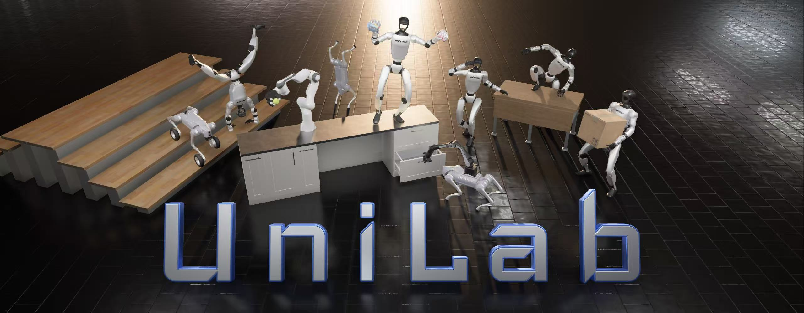

<h1 align="center"> UniLab </h1>

<h3 align="center">
面向跨物理后端机器人学习的契约驱动基础设施
</h3>

<p align="center">语言：简体中文 | <a href="README.md">English</a></p>

<p align="center">
  <a href="https://github.com/unilabsim/UniLab/actions/workflows/ci.yml"></a>
  <a href="https://unilabsim.github.io"></a>
  <a href="https://arxiv.org/abs/2605.30313"></a>
  <a href="https://arxiv.org/abs/2605.30313"></a>
  <a href="https://unilabsim.github.io/UniLab-doc/"></a>
  <a href="https://pypi.org/project/unilab/"></a>
  <a href="https://github.com/unilabsim/UniLab/blob/main/LICENSE"></a>
</p>

<h3 align="center">🎉 🎉 UniLab 已被 <b>CoRL 2026</b> 接收！ 🎉 🎉</h3>

<p align="center">
  
</p>

<p align="center"><em>用同一套任务编排体验覆盖运动、操作与动作跟踪。</em></p>

UniLab 是面向机器人强化学习的可配置基础设施。使用 Hydra 描述任务，
通过 manager term 组装任务，选择物理后端，再用统一 CLI 完成训练与评估。
同一套面向任务的 contract 可以把 CPU、GPU 和外部 worker 仿真连接到学习器运行时。

同一套框架已提供 Windows、Apple Silicon macOS、Linux CUDA、AMD ROCm 和 Intel XPU 的文档
路径。不同 backend/task 的成熟度按证据分级；请选择[支持矩阵](https://unilabsim.github.io/UniLab-doc/zh_CN/5-reference/5-support_matrix.html)
中有测试证据的组合。

可以先在[项目主页](https://unilabsim.github.io/#demos)观看策略运行，或阅读
[为什么选择 UniLab？](https://unilabsim.github.io/UniLab-doc/zh_CN/why_unilab.html)，
了解适用场景、证据和同类方案比较。

## 亮点

UniLab 的核心理念很简单：将任务语义定义为可复用的配置，然后独立更换仿真器、硬件或
learner，而无需重写任务的 environment 生命周期。

- **配置而非编码。** action、observation、reward、termination、event、command、
  curriculum 和 metrics 都是 manager term，在 Hydra owner YAML 中组装。基于已有 term
  的任务变体无需新写 environment class，很多时候完全不需要 Python 代码。
- **更换后端而不更换工作流。** 已注册仿真器遵循公开的 `SimBackend` contract。
  使用 `--sim` 选择后端；存在匹配 task owner 时，任务编排和训练/评估工作流保持一致，
  后端差异仍然显式。
- **让 solver 与 learner 的设备彼此独立。** CPU 并行、native 或 external-worker 仿真
  不必先变成 CUDA-resident simulator，也可以向 accelerator learner 提供数据；learner
  可以运行在 CUDA、ROCm、MPS 或 XPU 上。每个 backend/task 组合的证据等级请查看
  [支持矩阵](https://unilabsim.github.io/UniLab-doc/zh_CN/5-reference/5-support_matrix.html)。
- **加速 replay-based off-policy 训练。** FastSAC/FlashSAC 让仿真数据采集与 learner
  update 重叠。论文在代表性配置上报告了 3–10 倍端到端收益；测量范围和限制见
  [为什么选择 UniLab](https://unilabsim.github.io/UniLab-doc/zh_CN/why_unilab.html)。

## 快速开始

推荐使用 [`uv`](https://docs.astral.sh/uv/) 完成源码工作流。以下是运行策略 demo 的
最短路径：

```bash
curl -LsSf https://astral.sh/uv/install.sh | sh
git clone https://github.com/unilabsim/UniLab.git
cd UniLab

make setup
# 首次运行会从 Hugging Face 下载 checkpoint 和 asset。
uv run demo dance
```

Windows、macOS、CUDA、ROCm、XPU、可选后端和无头渲染的说明，请查看
[安装指南](https://unilabsim.github.io/UniLab-doc/zh_CN/1-getting_started/2-installation.html)和
[快速演示指南](https://unilabsim.github.io/UniLab-doc/zh_CN/1-getting_started/1-quick_demo.html)。

## 训练与评估

```bash
# 使用 Motrix 训练并回放一个任务。
uv run train --algo ppo --task go2_joystick_flat --sim motrix
uv run eval --algo ppo --task go2_joystick_flat --sim motrix --load-run -1

# 使用另一个已有配置的后端，保持同样的任务入口。
uv run train --algo ppo --task go2_joystick_flat --sim mujoco

# Replay-based off-policy 路径。
uv run train --algo sac --task g1_walk_flat --sim mujoco
```

这些 flag 会让 algorithm、task 和 simulator 选择保持可见。续训、W&B、Hydra override、
回放、后端安装和完整命令矩阵属于
[训练指南](https://unilabsim.github.io/UniLab-doc/zh_CN/2-user_guide/1-training/0-index.html)、
[后端指南](https://unilabsim.github.io/UniLab-doc/zh_CN/2-user_guide/3-backends/0-index.html)和
[支持矩阵](https://unilabsim.github.io/UniLab-doc/zh_CN/5-reference/5-support_matrix.html)。

## 生态

UniLab 被设计为机器人专属仓库共享的任务与训练界面。下游仓库可以独立发布机器人
recipe，同时消费同一套 task、backend 和 RL contract。目前的下游示例：

- [MicroDuck RL](https://github.com/unilabsim/microduck_rl_unilab)
- [EngineAI RL](https://github.com/unilabsim/engineai_rl_unilab)
- [Wuji](https://github.com/unilabsim/wuji_unilab)
- [Legged Manipulation](https://github.com/unilabsim/legged-manipulation_unilab)

## 文档

- [为什么选择 UniLab？](https://unilabsim.github.io/UniLab-doc/zh_CN/why_unilab.html)
- [安装与第一次 demo](https://unilabsim.github.io/UniLab-doc/zh_CN/1-getting_started/0-index.html)
- [训练与评估](https://unilabsim.github.io/UniLab-doc/zh_CN/2-user_guide/1-training/0-index.html)
- [后端支持矩阵](https://unilabsim.github.io/UniLab-doc/zh_CN/5-reference/5-support_matrix.html)
- [Sim-to-sim 部署](https://unilabsim.github.io/UniLab-doc/zh_CN/3-deployment/2-sim_to_sim/1-backend_swap.html)
- [开发者指南](https://unilabsim.github.io/UniLab-doc/zh_CN/4-developer_guide/0-index.html)

开发与贡献工作流请参阅[贡献指南](CONTRIBUTING.md)。

## 社区

<p align="center">
  
</p>

<p align="center">添加 UniLab 小助手微信，加入社区。</p>

## 引用

```bibtex
@article{jia2026unilab,
  title         = {UniLab: A Heterogeneous Architecture for Robot RL Beyond GPU-Dominant Paradigms},
  author        = {Jia, Yufei and Cao, Zhanxiang and Yu, Mingrui and Zhang, Heng and Chen, Shenyu and Jiang, Dixuan and Li, Meng and Li, Xiaofan and Liu, Yiyang and Wu, Junzhe and Li, Zheng and Fang, XiLin and Cui, Tingyu and Fu, Shengcheng and Li, Haoyang and Wang, Anqi and Wang, Zifan and Zhu, Dongjie and Cao, Chenyu and Huang, Zhenbiao and Zheng, Ziang and Lu, Jie and Ma, Xin and Wei, Zhengyang and Zhao, Xiang and Zhan, Tianyue and He, Ye and Chen, Yuxiang and Jiang, Yizhou and Li, Yue and Ge, Haizhou and Dong, Yuhang and Jia, Fan and Zhang, Ziheng and Zhang, Meng and Deng, Xiwa and Chen, Zhixing and Shao, Hanyang and Dong, Chenxin and Li, Yixuan and Chen, Yizhi and Chen, Bokui and Zhang, Kaifeng and Cui, Hanqing and Qin, Yusen and Huang, Ruqi and Han, Lei and Wang, Tiancai and Li, Xiang and Gao, Yue and Zhou, Guyue},
  journal       = {arXiv preprint arXiv:2605.30313},
  year          = {2026},
  url           = {https://arxiv.org/abs/2605.30313}
}
```

UniLab 以 [Apache License 2.0](LICENSE) 发布。独立的
[UniSim](https://github.com/unilabsim/unisim) 与
[UniLab RL](https://github.com/unilabsim/unilab_rl) 仓库包含各自的发布和引用信息。

## 致谢

如果没有 [Isaac Lab](https://github.com/isaac-sim/IsaacLab) 团队以及
[mjlab](https://github.com/mujocolab/mjlab) 开发团队和贡献者的出色工作，UniLab 不会
成为今天的样子。Isaac Lab 在 manager-based API 设计和抽象方面的工作，以及 mjlab
清晰、轻量的参考实现，共同塑造了 UniLab 的 Hydra + NumPy 任务编排体验。衷心感谢两个
社区分享他们的工作与想法。
